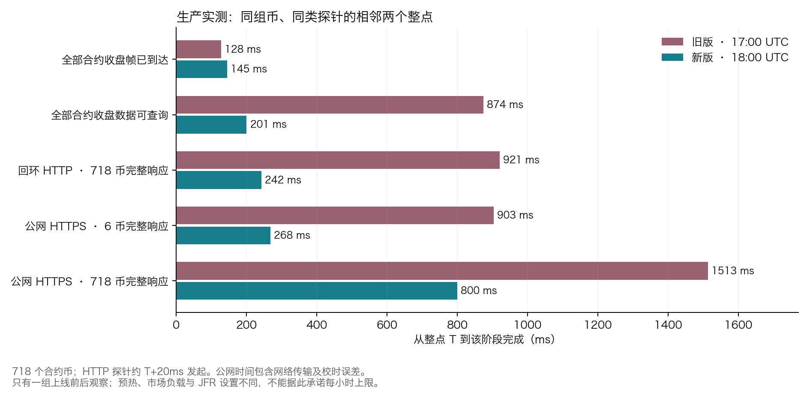
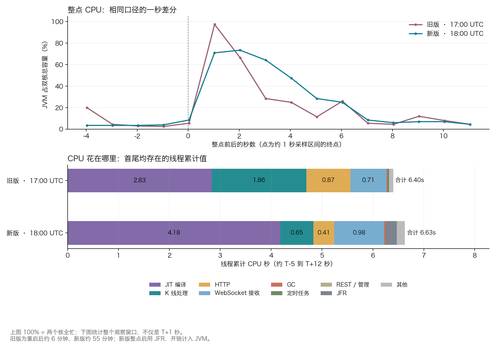
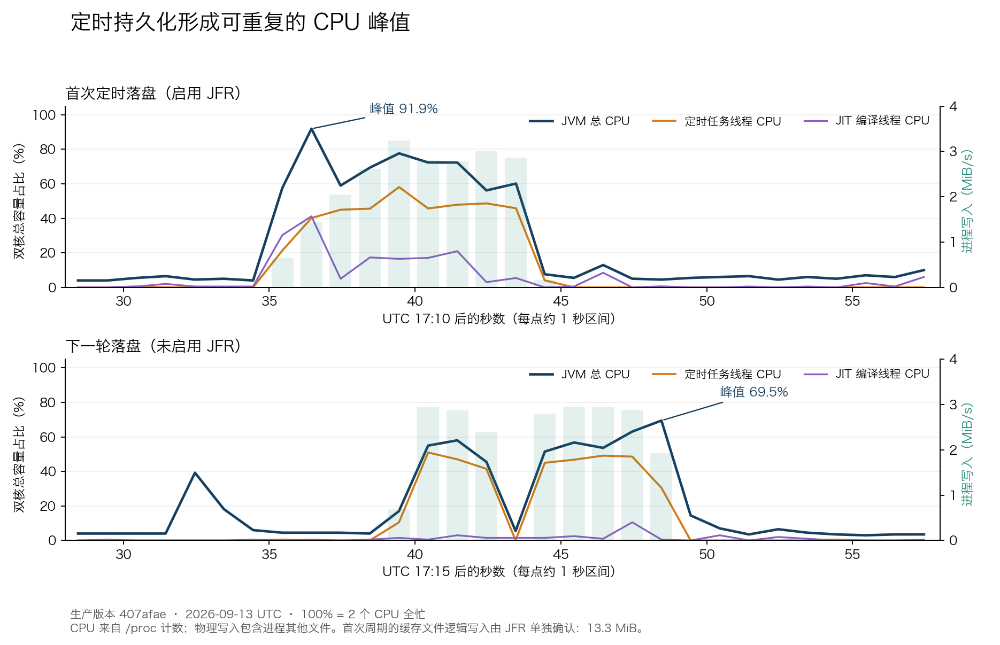

# kline-proxy 生产部署、整点延迟和 CPU 实测

2026-09-13，优化版本 `407afaedaa1bcad6ad10b363cf8d4bfdf66b8325` 已部署到 `kline-proxy` 实例。新进程于 **17:05:26 UTC / 21:05:26 迪拜时间**启动，17:09:33 UTC 完成验收，PID `517468`。合约 1h 的 `useContinuousKlineStream=true` 保持启用。

18:00 UTC / 22:00 迪拜时间的首次生产实测：**718 个合约的收盘数据全部可查询，从旧版 T+874ms 降至新版 T+201ms，缩短约 77%**。1,208 条合约／现货收盘消息全部处理。此次没有合并 forming 消息，性能改善不能归因于合并了大量中间快照。

这是一组真实上线前后观察，尚不能承诺每个整点稳定在 201ms 内。两个整点的预热时长、请求并发和 JFR 设置不同；下面同时披露没有改善的指标。

## 整点前后，到底早了多少

基线为 17:00 UTC 的旧版 `1025516`，新版为 18:00 UTC 的 `407afae`。币池一致：718 合约、490 现货。T 表示整点；接收／ready 日志使用程序的交易所校时，E 是 Binance 事件时间。

| 合约 1h 指标 | 旧版 17:00 UTC | 新版 18:00 UTC |
| --- | ---: | ---: |
| Binance E 最晚 | T+105ms | T+108ms |
| Netty 完整帧回调最晚 | T+128ms | T+145ms |
| 排队 p50 | 527.085ms | 33.503ms |
| 排队最大 | 745.606ms | 63.344ms |
| 全部收盘数据可查询 | **T+874.469ms** | **T+200.545ms** |
| handler 最晚完成 | T+888.349ms | T+221.654ms |

交易所事件和接收时间没有变得更早，程序内排队明显减少。新版最后 ready 的币是 RAREUSDT：E +108ms、完整帧接收 +145ms、排队 55.501ms、ready +200.545ms。各列最大值可能属于不同消息，不能直接相加。

现货 490 个币全部 ready 从 T+941.958ms 降至 T+177.984ms；handler 最晚完成从 T+949.160ms 降至 T+212.866ms。

HTTP 探针均约 T+20ms 发起，使用 `limit=2&closed_only=true`，分别查询固定 6 币集合和全部 718 币。下面是**完整响应体收到的时间**，包含序列化和传输：

| HTTP 完整响应 | 旧版 | 新版 |
| --- | ---: | ---: |
| 服务器回环，6 币 | T+817.116ms | T+187.856ms |
| 服务器回环，718 币 | T+920.841ms | T+242.070ms |
| 本机 Mac 经公网 HTTPS，6 币 | **T+903.246ms** | **T+268.190ms** |
| 本机 Mac 经公网 HTTPS，718 币 | **T+1513.358ms** | **T+799.862ms** |

公网 718 币响应约 187KB，新版从响应头到完整响应体仍用了约 487ms。服务端 T+201ms 可查询，不等于所有消费者在 T+201ms 收完数据。消费者如果固定 T+3 秒才发请求，仍受自己的发起时刻限制；本报告没有把用户举例的 T+3 秒当作旧版实测值。

## 收盘消息和数据内容核验

- 新版整点：合约 718/718、现货 490/490 均收到；ingress 接收和处理的 final 都是 **1,208**，失败、背压为 0。
- 整点前后约 17 秒的指标差分中，forming 接收／处理各 8,780，合并及旧快照计数均为 0。T+12 秒采样时队列和活动 worker 均为 0。
- 四个探针全部 HTTP 200、`finalized=true`、无 pending；最新 openTime 正确。服务器与公网返回的 K 线逐字段一致，6 币数据与 718 币响应中的对应行一致。
- 独立调用 Binance **`GET /fapi/v1/klines`**，按 symbol 查询刚收盘的一根 1h。BTCUSDT、ETHUSDT、ZKUSDT、UNITREEUSDT 和最后 ready 的 RAREUSDT，前 11 个数值字段全部相等；尾随零等文本格式差异按 Decimal 比较。此项是五币抽查，并非对所有币逐根 REST 审计。
- 18:08 UTC 另检查上述五币的磁盘分片，刚收盘的 final 行与捕获的 HTTP 数据数值一致。[落盘核验](../research/closed-bar-ingress/evidence/deployment-20260913/optimized-1800/persisted-final-verification.json)。
- 上线验收另外核对了 1h/1d 各 718 个币最近两根收盘 K 线，与换装前完全一致。

[整点原始记录和计算](../research/closed-bar-ingress/evidence/deployment-20260913/hour-comparison.json)、[REST 抽查](../research/closed-bar-ingress/evidence/deployment-20260913/optimized-1800/rest-verification.json)。接收／处理数量相等与数据内容核对分别成立；没有使用旧日志中固定为零的 dropped 字段代替这些核验。

## 整点 CPU 分布

服务器有 **2 个 CPU**。以下 CPU 使用率按双核总容量归一化，100% 表示两个核都忙；不同于 `top` 中进程最高可能显示 200% 的口径。

| JVM 指标 | 旧版 | 新版 |
| --- | ---: | ---: |
| T+约 0.03 到 T+1.03 秒的 CPU | 97.4% | 71.0% |
| 整点观察窗口内最高一秒 CPU | 97.4% | 73.5% |
| 相邻进程采样点覆盖约 16.012 秒的累计 CPU | 6.50 CPU 秒 | 7.32 CPU 秒 |

**延迟降低了，但这次全进程累计 CPU 没有降低。** 首个收盘边界仍触发明显 JIT 编译，新版还包含 JFR 开销。下面按线程分解，窗口约为 T-5 到 T+12 秒：

| 首尾均存在的线程 | 旧版 CPU 秒 | 新版 CPU 秒 | 新版占这些线程 CPU 的比例 |
| --- | ---: | ---: | ---: |
| JIT 编译 | 2.83 | 4.18 | 63.0% |
| 消息处理 worker | 1.86 | 0.65 | 9.8% |
| WebSocket 接收 | 0.71 | 0.98 | 14.8% |
| HTTP | 0.87 | 0.41 | 6.2% |
| JFR / attach | 0 | 0.21 | 3.2% |
| GC | 0.02 | 0.03 | 0.5% |
| 定时任务 | 0.03 | 0.01 | 0.2% |
| 其他 | 0.08 | 0.16 | 2.4% |
| 合计 | 6.40 | 6.63 | 100% |

线程表只统计首尾均存在的线程：旧版另有 5 个新线程累计 0.20 CPU 秒，新版另有 52 个新线程累计 0.34 CPU 秒，均是 HTTP 线程。线程快照不是原子读取，CPU ticks 精度为 10ms；其窗口也比上方进程差分多约一秒，不能混用两个分母。旧版消息 worker 是共享处理池，新版 K 线 worker 独立；1.86→0.65 是这两个线程组的观察值，不是严格隔离后的每条 K 线成本。

### 首批 POST 请求仍有冷启动成本

整点 JFR 记录到 116 次 monitor 等待，其中主要是 HTTP 线程在 `ClassLoader.loadClass → BeanPropertyBindingResult.createBeanWrapper → RequestResponseBodyMethodProcessor.resolveArgument` 路径上的竞争，最长约 **127ms**，发生在 T+1.08 秒附近。这是实际 POST 请求的 Spring 参数绑定路径；部署前的 GET 数据验收没有完整预热这条路径。

nginx 中两个整点分钟均完成 195 个 bulk 请求，全部 200，包含观测探针。请求耗时中位数 **24→29ms**，p90 **42→136ms**，最大 **812→276ms**。因此不能声称所有 HTTP 分位数都改善。类加载竞争与较慢的首批 POST 同时出现，是剩余延迟的直接线索；两小时请求集合的并发分布不同，不能将全部差异精确归因于单个方法。

nginx 完成时间只有秒级分辨率，且用户请求发起时刻不同；它的 request_time 不等于整点后的到达时间。[两组 nginx 统计](../research/closed-bar-ingress/evidence/deployment-20260913/optimized-1800/nginx-summary.json)、[整点调用栈及锁记录](../research/closed-bar-ingress/evidence/deployment-20260913/hour-window-jfr.json)。

## 内存 K 线定时落盘是否占用大量 CPU

**会，而且已连续复现。主要消耗在写文件前反复格式化历史数据。** 预热后的 17:14:13 至约 17:39:44 UTC，JVM 平均只占双核约 5.6%，但多轮落盘出现明显的数秒 CPU 峰值。

首次定时落盘的 JFR（17:10 UTC）记录到：

- 缓存文件写入 3,342 次，逻辑写入 13.259MiB，首尾写入事件跨度 8.639 秒；写文件调用累计耗时约 **56.99ms**，最长约 0.20ms。这不包含全部文件系统元数据工作，也不代表介质完成持久化的时间。
- 499 个持久化 Java 执行样本中，445 个经过 `ConvertUtil.doubleToString`，约 **89.2%**；主要是 `DecimalFormat`、浮点转十进制、字符串扩容。百分比分母是持久化执行样本，不是整个 JVM CPU。
- 持久化调用栈的对象分配采样权重约 **2.71GiB**，属于估计分配量，不是常驻内存增长；同期三个主要 GC 暂停约 65.56、42.24、43.44ms。
- 活跃的一秒采样区间中，JVM 峰值约 91.9%，定时任务约 7.98 CPU 秒，JIT 约 3.14 CPU 秒。

随后 **未开启 JFR** 的 17:15、17:20、17:25 三轮，峰值仍分别为 **69.5%、81.7%、88.7%**，调度线程分别约 7.40、6.96、7.05 CPU 秒。现货和合约的任务后来逐渐错开。启动预热和采样设置不同，不能把首次与后续轮次的差异全部归因于 JFR。

### 本次落盘有没有拖慢整点

本次 **T-5 至 T+12 秒内，没有缓存 FileWrite、没有持久化执行样本、没有 GC 暂停**。下一轮实际文件写入发生在 **18:01:04–07 和 18:01:23–27 UTC**。也就是说，落盘本身确实耗 CPU，但没有与这次 18:00 的收盘突发重叠。

整点后的这一轮再次记录到 548 个持久化执行样本，其中 498 个经过数字格式化（90.9%）；缓存写入 3,624 次、14.302MiB，写调用累计耗时 58.47ms。现货、合约对应窗口的 JVM 一秒峰值分别约 75.6%、93.3%，调度线程约 3.16、4.59 CPU 秒。此轮启用了 JFR。

代码中 `scheduleWithFixedDelay` 表示任务完成后再等待 300 秒，现货和合约各自漂移。持久化没有 REST 同步的整点避让，因此**不能由这一次没有重叠推断以后也不会重叠**。

### 重复工作的原因和下一步

1. [`afterKlineCommit`](../src/main/java/com/zx/quant/klineproxy/service/impl/AbstractKlineService.java) 在 forming 值变化时也标记 dirty，但实际持久化只保存 final。BTCUSDT、ETHUSDT 的现货／合约当天分片在 17:15 被重新写入，内容 SHA-256 与换装前相同，证明有内容不变的重写。
2. `dumpPersistedKlineSet` 取 final 快照后，仍将所有保留的历史 K 线重新排序并转换为 `PersistedKlineRow`；判断哪些日分片需要写发生在后面。
3. `toPersistedKlineRow` 复用 API 的 `ConvertUtil.convertToDisplayKline`，每条历史 K 线重新做十进制格式化、装箱和临时对象构造。

下一轮建议先用已有 `becameFinal / finalRevised` 收紧 dirty 条件，避免仅 forming 改变就重做持久化；再复用未变化 final 的编码结果、增加整点避让，并评估按变更分片保存。数字格式及恢复一致性需要保持，不能直接换成数值语义不同的 `Double.toString`。部署预热还应补上实际 POST 参数绑定和响应序列化路径。

本轮没有把这些新增建议直接改进生产程序，以保持上线对照版本一致。[持久化热点证据](../research/closed-bar-ingress/evidence/deployment-20260913/persistence-profile-summary.json)、[重复重写证据](../research/closed-bar-ingress/evidence/deployment-20260913/optimized-1800/unchanged-shard-rewrites.json)。

## 部署经过、测量边界和复现

- 安装包 SHA-256：`19390b7aba219a8807c1fa2c62d4ad801d999390d987a05ee181aa098c50ae12`，与已验证源码和安装包一致；生产源码没有在本轮观测中继续改变。
- 首次 16:50 换装因 150 秒内日线尚未全部恢复而自动回滚。线上只持久化 1h，1d 需 REST 冷加载；旧版回滚后也复现同样的日线恢复过程。17:05 重试保留完整数据核验，将等待上限改为 600 秒，约 247 秒后全部通过。这不是 HTTP 端口启动用了 247 秒，也不是当前仍处于回滚状态。
- 原 jar、unit、配置和完整缓存副本保留在 `/opt/kline-proxy/deployments/20260913_ingress_407afae_retry`。生产显式设置 4 worker、每 worker final 2048、forming 4096、closed key 2048、forming 合并开启，均是这版默认值。[配置含义](kline-ingress-implementation-20260913.md)。普通／连续协议仍分别实现，`useContinuousKlineStream` 的代码默认值仍为 false。
- 旧版整点距其重启约 6 分钟，新版距重启约 55 分钟；均是对应进程的第一次整点。此前旧版 14:00 和 16:00 的 ready 已在 T+2.096 秒、T+0.565 秒之间波动，所以不能选取历史最慢的一次来宣称稳定倍数收益。
- 公网探针用五次 time 请求中的最小 RTT 做中点校时。半 RTT 约为旧版 77–79ms、新版 77.5ms，仅作为时钟估算误差的参考，不是严格置信区间；也不是交易程序实际收包时间。E 到回调的差值包含交易所内部、网络、解帧和调度，不能全算成网络耗时。
- 1 秒 `/proc` 观察器记录 3,143 个样本，约 52 分钟，自身用 33.09 CPU 秒，约占双核容量 **0.53%**。JFR 开销计入新版 JVM CPU。第二段 JFR 没有产生有效的周期 CPULoad 序列，因此本报告使用 `/proc` 的一秒 CPU 口径，没有给出缺乏数据支持的 100ms CPU 图。
- JFR Java 栈样本不能覆盖全部原生 JIT／GC CPU，分配权重也不是精确分配字节数。原始 JFR 保留在本机临时目录及服务器部署目录；仓库只保存筛选后的性能证据，不保存其中的环境变量／系统属性。
- 18:02:59 UTC 最终检查：PID 不变、systemd active、NRestarts=0、final 接收／处理仍为 1,208/1,208，失败和背压为 0；JFR 录制及全部临时观察进程已正常结束。[最终状态](../research/closed-bar-ingress/evidence/deployment-20260913/optimized-1800/final-health.json)。

正式源码的 152 项执行通过证据已在[实现报告](kline-ingress-implementation-20260913.md)保存。本轮只部署同一安装包并新增观测材料，验证了实际数据、分段日志加和、计数、图表和线上状态；没有为未变的生产代码重复整套测试。尚需多个真实整点和 UTC 00:00 的 1h/1d 同时收盘观察，才能讨论稳定分布。本报告不推算策略收益。

[可复算脚本与证据说明](../research/closed-bar-ingress/deployment-observation/README.md)。
