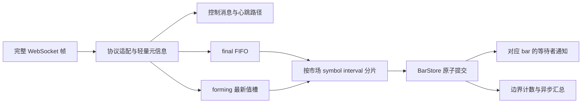

# kline-proxy 消息处理优化调研 — 2026-09-13

本文件保留实现前的调研记录，其中“当前实现”指研究基线 `1025516`。随后进行的自主优化、正式代码和验收结果见 [优化实现报告](kline-ingress-implementation-20260913.md)。原型结果与正式实现的结果分别保存。文中旧实现的代码须按该基线 commit 查看，工作树中的源码链接展示的是后续实现。

建议先修复收盘数据的并发提交与过载丢弃，再把逐消息收齐扫描改成边界级计数，随后引入“未收盘最新值合并 + 收盘消息独立优先队列”。这些改动有直接的代码、生产分段日志和本地 JFR 证据支持。单纯增加线程、扩大队列或更换 JSON 库，优先级较低。

分析基线为 `1025516aa9177bc6073284a37850ac85c32589d5`。本轮产物为调研报告、隔离回放原型和证据；生产实现尚未应用这些优化。

**生产延迟的来源**

此前没有分段记录的 `+1204 ms` 无法逐项还原。新增诊断后的 14:00 UTC 样本提供了可直接拆解的证据：合约 718/718、现货 490/490 均到齐；这次不是丢帧导致的尾延迟，消息丢弃计数为 0。

| 同一条最晚合约消息 UNITREEUSDT | 实测 |
| --- | ---: |
| Binance 事件 E | 整点后 106 ms |
| Netty 完整帧回调，已校时 | 整点后 131 ms |
| 消息线程池排队 | 1,936.694 ms |
| JSON / 分派 / 协议解码 | 0.055 / 0.019 / 0.099 ms |
| 缓存更新 / final 标记与通知 | 28.134 / 0.005 ms |
| 收盘数据可读 | 整点后 2,096.006 ms |
| 随后的收齐统计 | 77.435 ms |
| 消息处理及指标更新完成 | 整点后 2,173.444 ms |

这条消息从 E 到可读的差值中，排队占 97.32%。收齐统计虽然发生在该条消息 final 标记之后，仍持续占着工作线程，推迟后续币的处理。不能只看最后一个币自身的 JSON 或缓存耗时。

所有合约样本的收齐统计耗时 p50=2.868 ms、p90=17.794 ms；JSON、解码、缓存、final 通知的 p50 分别为 0.029、0.055、0.012、0.002 ms。这些是经过时间，包含调度等待，不等同于 CPU 时间。[完整生产分析](../research/closed-bar-ingress/evidence/production-1400-report.md)、[计算结果](../research/closed-bar-ingress/evidence/production-1400-analysis.json)。

消息处理池是静态共享的：现货、合约、不同周期及已注册的 ticker handler 共用它。配置为 core=4、max=20、队列 4096；此次实际为 4 个工作线程。达到 core 后先入队，队列满了才尝试增至 max，不能把 max=20 理解成始终有 20 个线程处理。生产只有 2 个 CPU，整点前两秒已饱和；重启后的第一次整点还有明显 JIT 编译开销。[代码](../src/main/java/com/zx/quant/klineproxy/client/ws/client/AbstractWebSocketClient.java)、[JDK 21 线程池规则](https://docs.oracle.com/en/java/javase/21/docs/api/java.base/java/util/concurrent/ThreadPoolExecutor.html)。

**JFR 确认的主要热点**

使用本机 Zulu JDK 21.0.8 的 JFR，执行真实的 WebSocket JSON 解析、普通/连续合约协议实现、Kline 转换、缓存、final 通知、收齐统计和消息指标。没有启动 Spring、连接交易所或修改线上进程。

预热后的基线共取得 496 个消息处理线程执行样本，其中 445 个，即 **89.7%**，位于 `recordClosedBarArrival` 调用链。叶子热点包括数组复制、`ConcurrentSkipListMap.doGet`、遍历 `ConcurrentHashMap` 和构建 HashSet；不是主要耗在 JSON 解码。这里的百分比只针对本次消息工作线程样本，不代表全进程 CPU，也不是精确的方法计时。

原因是每条 `x=true` 都会：查询当前交易币列表、构建 HashSet，再通过 `symbolsWithBar` 遍历整个 `klineSetMap`，逐个查该 openTime 是否存在。假设一个边界有 N 个收盘币、内存有 M 个 symbol/interval 集合，扫描量约为 O(N×M)，此外还有 N 次交易币集合构建。

固定币池的隔离原型把交易币集合、预期到齐集合移到边界创建时构建；后续按唯一 symbol 计数，最终汇总时才重新扫描和排序。普通回放中，全进程 CPU 消耗中位数从 **173.8 ms/轮降至 80.1 ms/轮，下降约 54%**。工作线程分配采样的加权总量从约 86.3 MiB/轮降至 19.9 MiB/轮；这是采样估计，不是精确分配字节数。基线采样分配约 83% 经过收齐统计调用链。[JFR 分析](../research/closed-bar-ingress/evidence/jfr-analysis.json)。

原型仍在边界首次创建时执行扫描，JFR 也捕获到了该处 `ConcurrentHashMap.compute` 的锁等待。正式实现应提前准备边界状态、正常消息走读取快路径，避免在共享 map 的 compute 锁内扫描。把统计聚合移交独立组件后，消息线程只发布轻量的“已提交”事件。

**本地回放结果及其适用范围**

本机为 macOS arm64，JVM 参数 `-Xms1g -Xmx2g -XX:ActiveProcessorCount=2`。这个参数只影响 JVM 对 CPU 数量的判断，**不限制进程只能占用两个 CPU**。Docker 新容器停在 Created 阶段，已清理本次创建的两个容器；没有用容器限核结果冒充生产测量。

每组单独启动 JVM，预热 12 轮、测量 10 轮，表中为测量轮的中位数。每轮 718 个合约币（528 PERPETUAL、190 TRADIFI_PERPETUAL）和 490 个现货币；每个币预装 1h、1d 各 1000 根历史。价格和帧是合成数据，代码处理路径是真实的。普通回放为每个币各一条旧 bar 未收盘、旧 bar 收盘、新 bar 未收盘消息，合计 3,624 条；收盘注入时刻参照生产样本，最后一条为整点后 131 ms。

| 普通回放 | CPU ms/轮 | 每轮最晚收盘 handler 完成，整点后 ms | 收盘处理条数 |
| --- | ---: | ---: | ---: |
| 当前实现 | 173.8 | 136.2 | 1,208/1,208 |
| 边界级收齐计数 | 80.1 | 132.6 | 1,208/1,208 |
| 边界级计数 + 合并队列 | 77.9 | 133.5 | 1,208/1,208 |

普通回放没有待合并的重复 forming 消息，合并队列没有明显附加收益。其 CPU 与仅改统计的差异不应解读成确定的吞吐提升。当前实现的测量轮 CPU 范围为 155.2–294.1 ms，仅改统计为 48.8–148.2 ms；本机调度、JIT、GC 和有限样本仍有波动。这里的 handler 完成时间包含收齐统计及诊断记录，比生产日志的 ready 标记口径更晚。

突发回放则对每个币连续发送 20 条旧 bar forming、1 条旧 bar final、20 条新 bar forming，共 **49,528 条**，不做真实网络节流，用于验证积压和正确性。它不是对线上流量频率的估计。

| 突发回放 | CPU ms/轮 | 实际处理 final 条数，中位数（范围） | 最终缓存校验 |
| --- | ---: | --- | --- |
| 当前实现 | 384.1 | 1,000（795–1,042）/1,208 | 收盘和新 bar 均出现错误 |
| 仅改收齐统计 | 250.8 | 817.5（705–919）/1,208 | 仍有丢失和乱序写入 |
| 计数 + 合并队列 | 149.7 | 1,208（始终全部）/1,208 | 10/10 轮全部正确 |

非整数条数是 10 轮中位数的结果。原队列在饱和后可扩至 20 线程，之后采用 DiscardOldest；丢弃情况取决于生产者、消费者和扩线程时序，所以“统计更快”并不保证这种瞬时突发下少丢帧。丢了数据的方案不能作为等量工作吞吐对照，也不能用其较短延迟证明优化成功。

合并原型每轮原本有 48,320 条 forming；最终约 2,410 条进入完整 handler，其余在排队阶段被后来的 forming 或 final 替代，减少约 **95% 的 forming 完整处理工作**。所有 final 均进入独立 FIFO 并得到处理；总 CPU 数字已包含对全部原始帧进行 JSON 流式元信息扫描的成本。

重复收盘测试再把每个币的 final 连发 5 条：每轮 **6,040/6,040 条 final** 均经过 handler，10 轮无收盘丢失、无最终值错误、无最新 forming 错误。重复 final 可以幂等提交，但原型没有把它们当作 forming 合并掉。

完整逐轮结果、极值与计数见 [summary.json](../research/closed-bar-ingress/evidence/summary.json) 及同目录原始 JSON。原型的 final 队列和 slot 生命周期尚未实现生产级容量与回收策略；这些通过的回放不代表已证明所有并发交错、重连或故障条件下都正确。

**必须先处理的正确性缺口**

现有 `DiscardOldestPolicy` 工作在解析之前。队头只是 Runnable，丢弃时不知道是否为 `x=true`。因此目前不能保证过载不丢收盘消息。这一点已被突发回放直接复现。[JDK 丢弃策略](https://docs.oracle.com/en/java/javase/21/docs/api/java.base/java/util/concurrent/ThreadPoolExecutor.html)。

`updateKlinesInternal` 又采用 `get → 比较 tradeNum → put`，线程安全的 map 不会自动让这组三步成为原子操作。对基线的确定性探针复现了以下结果；探针仅在 map.put 前控制线程交错，调用的仍是生产缓存代码。

| 输入条件 | 期望 | 当前结果 |
| --- | --- | --- |
| 先有 n=10、close=101；再收到 n=10、close=109 的 final | 保存 final 的 109 | close 仍为 101，却被标记 final |
| 旧 forming n=10 判断可写后暂停；新 forming n=20 写完；旧线程恢复 | 保留 n=20 | 回退为 n=10 |
| 同上，但新消息为 n=20 的 final | 保留最终 n=20、close=109 | final=true，数据却回退为 n=10、close=101 |

第一项证明即使收盘快照字段变化，成交笔数相等时也会被拒绝；并不声称已在线上观察到 Binance 发送这种字段修订。后两项是确定的并发写入缺口。[探针](../research/closed-bar-ingress/src/CorrectnessProbe.java)、[复现结果](../research/closed-bar-ingress/evidence/correctness.json)。

因此，“收到并执行每条 final”和“最终缓存保存正确 final”必须分别校验。优先级队列可能进一步改变处理顺序，不能绕过这个存储修复。

**建议的实现结构**

保留现有 `BinanceKlineStream`、`BinanceContinuousKlineStream` 两个协议类及共同父类。普通/连续流负责识别、解码、symbol 映射；调度、缓存提交和 bulk 等待各有独立组件，继续支持 `useContinuousKlineStream` 配置。

形成中消息的槽键至少包含 `市场、规范化 symbol、interval、openTime`。worker 分片按 `市场、symbol、interval`，同一序列不同 openTime 仍由同一写入者处理。普通流与连续流在切换期间可能同时到达，不能用未经映射的 `ps` 和 `s` 形成两套互不认识的存储键。

每个 forming 槽只保留尚未开始处理的最新有效快照，并最多放一个待处理 token。新的快照替换旧的待处理值；不必人为等待 10–100 ms 收集一个批次。有消息可处理就处理，只有本来存在排队时才合并。不能按 symbol 跨 openTime 合并，否则新小时可能覆盖旧小时收盘。

final 不进入覆盖槽，每条都进入独立 FIFO；同槽未处理 forming 可以由 final 替代。worker 优先取 final。正在执行的 forming 无需强行中断，但它之后的提交不得覆盖 final。重复 final 仍须经过处理、校验和计数，允许存储层做幂等提交；不能静默吞掉内容不同的 final 修订。

这里的“最新”还需要显式版本规则。单连接接收顺序、协议版本字段和重连 epoch 应保留到统一事件；不能把 E 当成唯一版本号。连续流 `f/L` 表示 updateId，普通流 `f/L` 表示 trade ID，也不能把两种 L 混为同一个全局序号。[Binance 官方消息定义](https://developers.binance.com/en/docs/catalog/core-trading-derivatives-trading-usd-s-m-futures/api/ws-streams/market)。研究原型只验证了单来源、按序注入的 forming；正式 coalescer 还要拒绝把乱序旧快照合并到新快照之上。

`BarStore` 应原子发布包含数据、final 状态、来源和版本的快照。final 可替代同 n 的 forming；forming 不得回写已 final 的 bar；较旧更新不得覆盖较新状态。REST 补数、恢复及 synthetic fill 也必须遵守同一提交规则，不能因为 WebSocket 已分片就保留 REST 直接并发 put 的旁路。可以先用每序列的提交锁/原子 compute 收紧写入，再逐步迁移为不可变 BarState；查询侧也要取得匹配的数据与 final 状态。

队列可靠性需要明确过载边界：forming 槽与 token 数量有界、关闭窗口及时回收；final 容量依据峰值和可容忍停顿配置，容量不足时必须触发背压、受控暂存或明确失败与恢复流程，不能继续 DiscardOldest。直接让 Netty 线程执行全部业务的 CallerRuns 会推迟其他帧与心跳，也不适合直接替换。若要求进程崩溃后仍保留已接收的每条 final，还需要持久日志与重放；REST 可恢复最终 bar 内容，不能恢复每条原始 WebSocket 消息。

解析失败、未知控制消息、订阅应答、心跳不能走 forming 合并路径。心跳在实际收帧时更新；指标区分 received、merged、handled、committed、final received/processed、拒绝旧版本和恢复，避免把“少处理 forming”误报成断流。原型的流式扫描只是测成本的实现，正式版本应复用协议适配器，并验证 raw/combined 两种封装和字段顺序。

收齐组件的预期集合应在边界开始前基于订阅/缓存和交易状态准备，关闭事件只做唯一币计数。边界内新上市、下架、交易状态改变、REST 先到和迟到旧边界应有明确更新规则；固定 expected 数不能掩盖缺币。最好分别记录“缓存已提交 final 的币数”与“实际收到 x=true 的币数”，避免 REST 恢复掩盖收盘流遗漏。排序、pending 列表和日志格式化放在完成或超时后的汇总线程。

**bulk 与其他步骤的优先级**

当前 `signalFinal()` 对全服务 condition 使用 `signalAll()`，每个不同 bulk 请求被唤醒后会重查自己请求的币。已有 single-flight 只合并完整请求键相同的请求，不会自动合并不同 symbol 子集。检查 pending 与进入 await 也不在同一临界区，错过通知时依赖至多 25 ms 的轮询恢复。

用 96 个预先创建并复用的 reader，统一在整点后约 5 ms 开始查询不同的 6 币集合，得到以下对照。这个场景不包含 HTTP、网络或响应 JSON 序列化。

| bulk 回放 | CPU ms/轮 | 每轮最后 bulk 返回，整点后 ms |
| --- | ---: | ---: |
| 当前实现 | 237.1 | 138.4 |
| 改收齐计数，保留广播 | 96.2 | 131.8 |
| 改收齐计数，关闭广播，仅轮询 | 84.9 | 154.1 |

仅轮询少用约 12% CPU，却增加约 22 ms 的查询尾延迟，因此不建议作为低延迟方案。更合适的是每个 `(market, symbol, interval, openTime)` 的完成事件，只通知真正等待它的请求；或在非常短的提交批次末合并通知。注册等待者后必须重新检查 final，超时/取消后清理订阅。该定向通知方案尚未实现压测，收益不能沿用上面的轮询差值。

本次早期 bulk 回放使用 reader 自身的短睡眠来对齐启动，额外产生了调度开销；这些结果已排除，报告只引用 `*-bulk96-gated.json`。不能将早期场景的全部 CPU 增量归因于程序广播。

| 顺序 | 工作 | 依据与边界 |
| --- | --- | --- |
| P0 | 原子 final 提交、过载不丢 final、统一 REST/WS 写入规则 | 已复现数据错误和 final 丢失；先保证可靠性 |
| P1 | 边界级收齐计数、异步汇总、交易币快照复用 | 最大已测 CPU/分配热点；正常流量也受益 |
| P1 | forming 合并、final 优先、同序列串行处理 | 突发时显著减少冗余工作；要和 P0 一起验收 |
| P2 | bulk 定向完成通知 | 有广播浪费和最长 25 ms 漏通知补偿；实测次于收齐扫描 |
| P2 | 单条 WebSocket bar 更新快路径 | 当前复用批量更新，创建集合/列表、排序；消除统计热点后再优化分配 |
| P3 | 调整分片数、隔离现货/合约竞争、启动预热 | 在生产等规格 2 CPU 上比较；保留 CPU 余量，避免开到 20 线程抢占 |
| P3 | JSON/指标/持久化与 API 序列化 | 当前 JSON 不是首要热点；持久化回放只含 dirty-key 标记，未测磁盘与 HTTP |

普通消息无需每条都走 `fillKlines` 的批量排序/集合构建。可为“当前 openTime 更新”做小路径，真正出现时间缺口、REST 批量补数或裁剪阈值到达时走原有慢路径。但不能删掉缺口填充和保留范围检查。当前裁剪本来就有数量阈值，并非每条都遍历删除历史。

首个整点的 JIT 可通过预热常用协议、数值类型和缓存更新路径减轻；重启后应单独记录首次边界。关键生产窗口没有秒级 GC 暂停证据，因此目前不以更换 GC 为第一项。扩大队列只会延迟过载出现，增加 core 也不能消除 O(N×M) 工作量和错误写入。

**落地验证与交付**

正式改动需要覆盖：相同 n 的 final、旧 forming 与 final 并发提交、重复/修订 final、两个 openTime 和多个 interval、普通/连续双来源切换、乱序与重连、满队列与排空关闭、REST 并发补数、下架与新币、bulk 注册竞态及超时清理。按“每条接收的 final 已处理”和“缓存最终数据正确”分别断言，并核对 forming 的最后有效快照。

性能验收先在与生产相同的 2 CPU 环境回放，再上线小范围观察多个整点，覆盖 UTC 00:00 的 1h/1d 同时收盘与重启后的首轮。应比较同一边界的 frame→final p50/p90/p99/max、队列年龄、未完成 final 数、CPU/分配、bulk 尾延迟；只看 Binance E 或平均值不够。当前本机 132–133 ms 的完成结果受注入时间和机器性能限制，不能承诺生产会得到相同数字。

源码、两项隔离补丁、JFR 分析与逐轮证据位于 [research/closed-bar-ingress](../research/closed-bar-ingress/README.md)。从指定 commit 重新构建的复现 smoke 已验证三条路径都处理全部 1,208 条 final，同时再次复现三项缓存反例。上述隔离研究阶段未修改 `src/main`，未上线或变更策略逻辑；本报告也没有推算交易收益影响。
